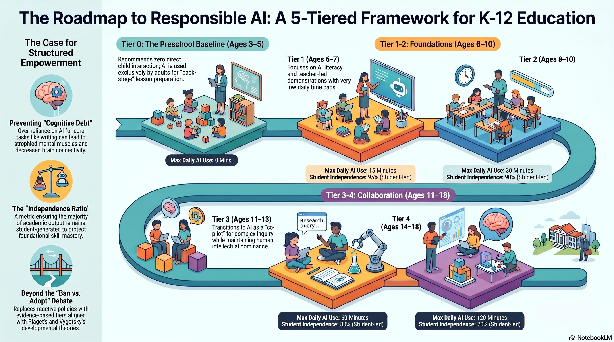
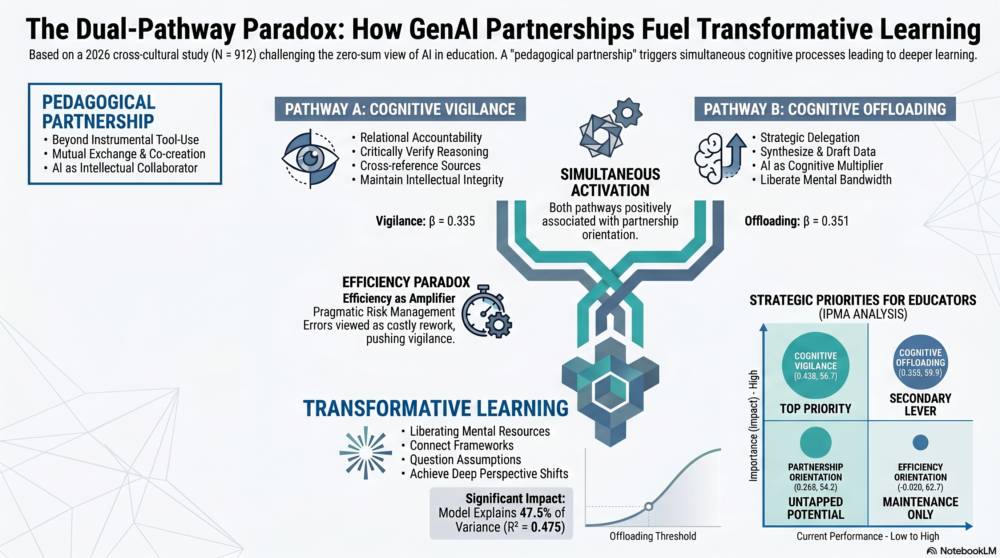
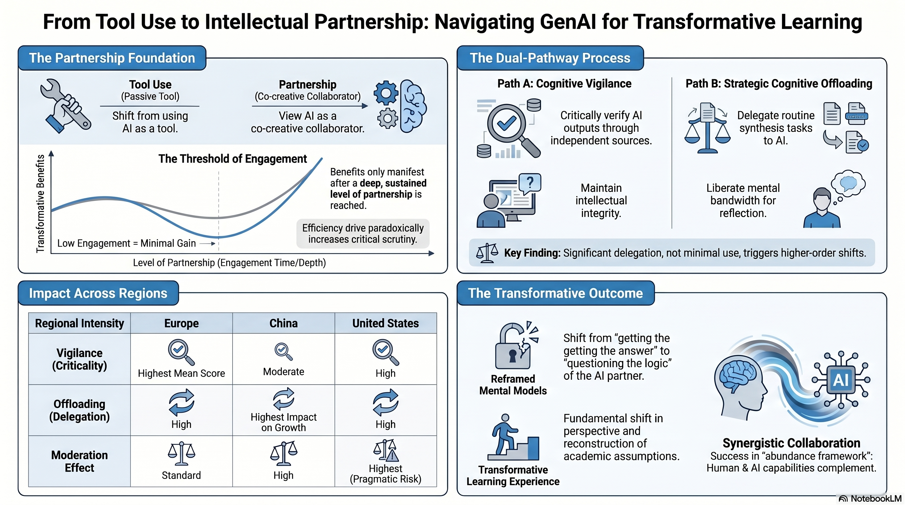

Pairing this class with working with early childhood students (using academia’s definition of early childhood) has been incredibly interesting. I was discussing some of my research ideas with a visiting writing/scholar at my school, and the idea of “But should we even teach that to kids this young?” came up. We had a debate over the idea of protecting development (cognitive, social emotional, and physical) as well as the balance of using tools such as AI to enhance personal interest development and the hard work of thinking in both school learning and everyday life information behaviors. 
The nice thing about technology and learning is solid pedagogy in the physical classroom is solid pedagogy in digital spaces. Adult learners can also struggle with self-regulation in distributed learning, struggling to contend with the siren song of notifications, but students in early childhood are still developing their executive function skills and this makes these self-regulation issues more pernicious. There is also emerging research that combines AI literacy frameworks with child development (cognitive and moral) to help create guidelines for how much and when to use AI (Tao, 2025). 

Credit: Image generation by NotebookLM, source material is <a href="https://www.springernature.com/gp/open-science/about/the-fundamentals-of-open-access-and-open-research">Tao, 2025</a>

There is also emerging research that all cognitive offloading with AI use is not created equal, and that a person (student, teacher, professional, or general use) is moderated by their desire to do things quickly or efficiently (Wang and Zhang, 2026), but the relationship to vigilance is important: those with higher vigilance saw efficiency as using AI and checking it for accuracy so they do not have to re-do work-  the ultimate inefficiency. 
  

Credit: Image generation by NotebookLM, source material is <a href=" https://doi.org/10.1186/s41239-026-00585-x">Wang and Zhang, 2026</a>

This requires metacognition, and I think – but need to research – if it also means users need a theory of mind that extends to AI as well as humans. All of these are emerging skills, especially in early childhood education (age 3 through 4th grade), and the language of AI (general and domain-specific) is needed to use AI to its fullest. For example, in designing the graphics for this page with NotebookLM, I needed to create a custom prompt to get the visual results I wanted, but struggle because I don’t have the specific graphic design language to accurately assign what I want. This general and domain-specific knowledge must 
One key factor discussed in our book was the idea that many digital environments being studied do not solely live in a single digital environment, but across multiple digital places as well as extending into the physical world. This complex interplay of digital, physical, and social systems (across physical and digital places) makes teaching with and about digital technology in early childhood more complex. The idea that the hard work of education and thinking must be maintained is true – but we can also see that supporting that complex thinking by utilizing technology to assist and support lower-order thinking supports developing higher-order thinking. 

_References_

Tao, S. (2025). Aligning technology with cognitive development: A five-tiered framework to generative AI in K-12 education. _AI, Brain and Child_, 1(1), 20. https://doi.org/10.1007/s44436-025-00024-0

Wang, S., & Zhang, H. (2026). Pedagogical partnerships with generative AI in higher education: How dual cognitive pathways paradoxically enable transformative learning. _International Journal of Educational Technology in Higher Education_, 23(1), 11. https://doi.org/10.1186/s41239-026-00585-x

